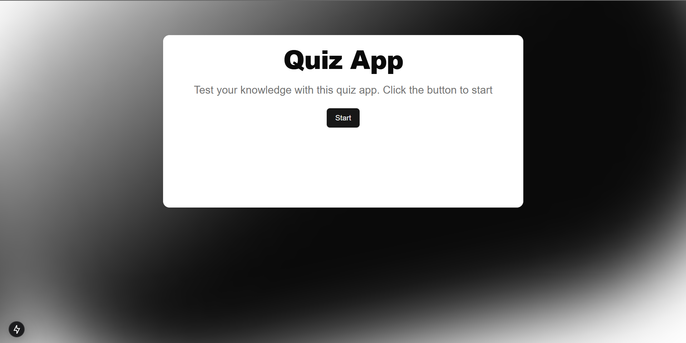
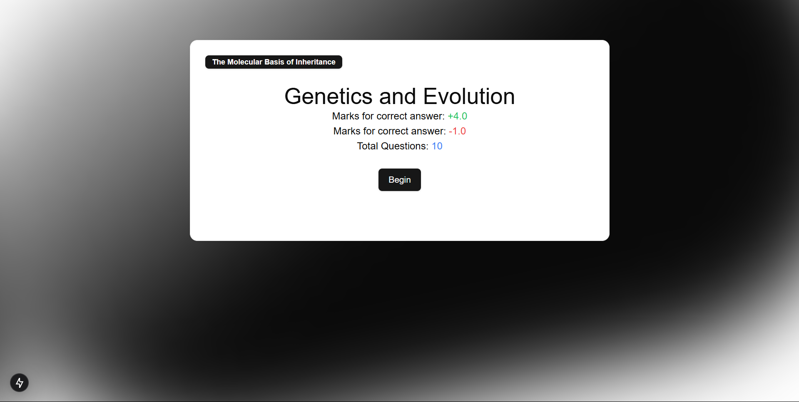
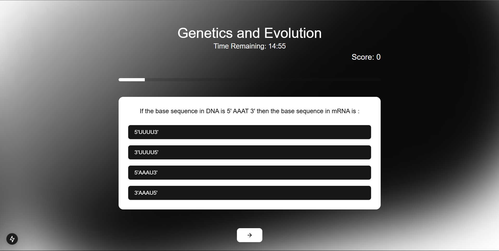

# Quizz App

## Overview

This project is a web application built using modern web technologies. It includes features such as a quiz fetching system, a theme provider, and a carousel component.

## Technologies Used

- **Next.js**: A React framework for server-side rendering and static site generation.
- **React**: A JavaScript library for building user interfaces.
- **TypeScript**: A typed superset of JavaScript that compiles to plain JavaScript.
- **Tailwind CSS**: A utility-first CSS framework for rapid UI development.
- **PNPM**: A fast, disk space-efficient package manager.
- **PostCSS**: A tool for transforming CSS with JavaScript plugins.
- **ESLint**: A tool for identifying and fixing problems in JavaScript code.

## Project Structure

```
.gitignore
.next/
actions/
app/
components/
lib/
public/
README.md
package.json
pnpm-lock.yaml
postcss.config.mjs
tailwind.config.ts
tsconfig.json
```

## Installation

1. **Clone the repository:**

   ```sh
   git clone https://github.com/your-repo/project-name.git
   cd project-name
   ```

2. **Install dependencies:**

   ```sh
   pnpm install
   ```

3. **Run the development server:**

   ```sh
   pnpm dev
   ```

4. **Build the project for production:**

   ```sh
   pnpm build
   ```

5. **Start the production server:**
   ```sh
   pnpm start
   ```







## Contributing

1. Fork the repository.
2. Create a new branch (`git checkout -b feature-branch`).
3. Make your changes.
4. Commit your changes (`git commit -m 'Add some feature'`).
5. Push to the branch (`git push origin feature-branch`).
6. Open a pull request.

## License

This project is licensed under the MIT License. See the LICENSE file for details.

## Acknowledgements

- [Next.js](https://nextjs.org/)
- [React](https://reactjs.org/)
- [TypeScript](https://www.typescriptlang.org/)
- [Tailwind CSS](https://tailwindcss.com/)
- [PNPM](https://pnpm.io/)
- [PostCSS](https://postcss.org/)
- [ESLint](https://eslint.org/)
